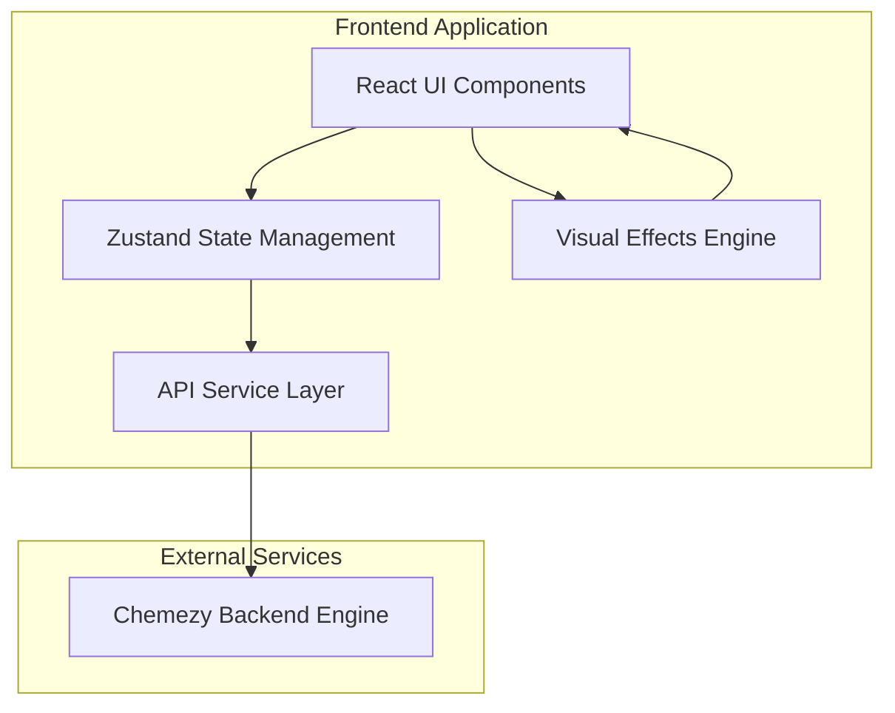

# Design Document

## Overview

The Chemezy Frontend is a React-based single-page application that provides an interactive virtual chemistry laboratory for middle and high school students. The application emphasizes a game-like interface with intuitive drag-and-drop interactions, real-time visual effects, and gamification elements to make chemistry education engaging and accessible.

The design follows a component-based architecture using modern React patterns, with a focus on performance, accessibility, and responsive design. The application communicates with the Chemezy Backend Engine through a well-defined REST API and provides immediate visual feedback for all user interactions.

## Architecture

### High-Level Architecture



### Technology Stack

- **Framework**: React 18 with Vite for fast development and building
- **Styling**: Tailwind CSS for utility-first styling and responsive design
- **State Management**: Zustand for lightweight, scalable global state
- **HTTP Client**: Axios for API communication with interceptors for authentication
- **Routing**: React Router v6 for client-side navigation
- **Animation**: Framer Motion for smooth transitions and micro-interactions
- **SVG Generation**: Custom procedural SVG generation for visual effects
- **Development Tools**: ESLint, Prettier, and TypeScript for code quality

### Application Structure

```
src/
├── components/           # Reusable UI components
│   ├── ui/              # Basic UI components (Button, Input, Modal)
│   ├── layout/          # Layout components (Header, Sidebar, Footer)
│   ├── auth/            # Authentication components
│   ├── lab/             # Lab-specific components
│   ├── dashboard/       # Dashboard components
│   └── effects/         # Visual Effects Engine components
├── pages/               # Top-level page components
├── hooks/               # Custom React hooks
├── services/            # API service layer
├── store/               # Zustand stores
├── utils/               # Utility functions
├── types/               # TypeScript type definitions
└── assets/              # Static assets
```

## Components and Interfaces

### Core Components

#### 1. Authentication System
- **LoginForm**: Handles user login with form validation
- **RegisterForm**: Manages user registration with email validation
- **AuthGuard**: Protects routes requiring authentication
- **AuthProvider**: Manages authentication state and token handling

#### 2. Lab Interface Components
- **LabBench**: Main experiment workspace with drop zones
- **ChemicalInventory**: Searchable list of available chemicals
- **ChemicalCard**: Individual chemical display with drag functionality
- **EnvironmentSelector**: Environment selection interface
- **ReactionTrigger**: Button to initiate chemical reactions
- **ResultsDisplay**: Shows reaction products and explanations

#### 3. Visual Effects Engine
- **EffectsRenderer**: Main component orchestrating all visual effects
- **GasEffect**: Renders gas production animations
- **LightEffect**: Displays light emission effects
- **TemperatureEffect**: Shows heating/cooling visual indicators
- **FoamEffect**: Animates foam production
- **StateChangeEffect**: Visualizes state transitions
- **VolumeChangeEffect**: Shows expansion/contraction
- **SpillEffect**: Animates liquid spilling
- **TextureChangeEffect**: Displays texture modifications

#### 4. Dashboard Components
- **UserDashboard**: Main dashboard layout
- **AwardsGrid**: Displays earned awards in a grid layout
- **ProgressTracker**: Shows progress toward unearned awards
- **LeaderboardTable**: Displays user rankings
- **StatsOverview**: Summary of user statistics
- **ReactionHistory**: List of past reactions

#### 5. UI Components
- **Button**: Consistent button styling with variants
- **Input**: Form input with validation states
- **Modal**: Reusable modal component
- **LoadingSpinner**: Loading state indicator
- **ErrorBoundary**: Error handling wrapper
- **Toast**: Notification system

### State Management Architecture

#### Authentication Store
```typescript
interface AuthStore {
  user: User | null;
  token: string | null;
  isAuthenticated: boolean;
  login: (credentials: LoginCredentials) => Promise<void>;
  register: (userData: RegisterData) => Promise<void>;
  logout: () => void;
  refreshToken: () => Promise<void>;
}
```

#### Lab Store
```typescript
interface LabStore {
  selectedChemicals: SelectedChemical[];
  environment: Environment;
  reactionResult: ReactionPrediction | null;
  isReacting: boolean;
  addChemical: (chemical: Chemical, quantity: number) => void;
  removeChemical: (chemicalId: number) => void;
  setEnvironment: (environment: Environment) => void;
  triggerReaction: () => Promise<void>;
  clearLab: () => void;
}
```

#### Dashboard Store
```typescript
interface DashboardStore {
  awards: UserAward[];
  availableAwards: AvailableAward[];
  leaderboard: LeaderboardEntry[];
  userRank: UserRank | null;
  reactionStats: UserReactionStats | null;
  fetchAwards: () => Promise<void>;
  fetchLeaderboard: (category?: AwardCategory) => Promise<void>;
  fetchUserRank: (category?: AwardCategory) => Promise<void>;
}
```

### API Service Layer

#### Authentication Service
```typescript
class AuthService {
  async login(credentials: LoginCredentials): Promise<AuthResponse>;
  async register(userData: RegisterData): Promise<UserResponse>;
  async getCurrentUser(): Promise<UserResponse>;
  async refreshToken(): Promise<AuthResponse>;
}
```

#### Chemical Service
```typescript
class ChemicalService {
  async getChemicals(params: PaginationParams): Promise<PaginatedChemicals>;
  async getChemical(id: number): Promise<Chemical>;
  async createChemical(data: ChemicalCreate): Promise<Chemical>;
}
```

#### Reaction Service
```typescript
class ReactionService {
  async predictReaction(request: ReactionRequest): Promise<ReactionPrediction>;
  async getReactionCache(): Promise<ReactionPrediction[]>;
  async getReactionStats(): Promise<UserReactionStats>;
}
```

#### Awards Service
```typescript
class AwardsService {
  async getUserAwards(params: AwardParams): Promise<UserAward[]>;
  async getAvailableAwards(category?: AwardCategory): Promise<AvailableAward[]>;
  async getLeaderboard(category?: AwardCategory): Promise<LeaderboardEntry[]>;
  async getUserRank(category?: AwardCategory): Promise<UserRank>;
}
```

## Data Models

### Core Data Types

```typescript
interface Chemical {
  id: number;
  molecular_formula: string;
  common_name: string;
  state_of_matter: StateOfMatter;
  color: string;
  density: number;
  properties: Record<string, any>;
}

interface ReactionRequest {
  reactants: ReactantInput[];
  environment: Environment;
  catalyst_id?: number;
}

interface ReactionPrediction {
  products: ProductOutput[];
  effects: VisualEffect[];
  explanation: string;
  is_world_first: boolean;
  state_of_product?: string;
}

interface VisualEffect {
  effect_type: EffectType;
  [key: string]: any; // Effect-specific properties
}

interface UserAward {
  id: number;
  user_id: number;
  template_id: number;
  tier: number;
  progress: Record<string, any>;
  granted_at: string;
  template: AwardTemplate;
}
```

### Visual Effects Data Models

```typescript
interface GasProductionEffect {
  effect_type: 'gas_production';
  gas_type: string;
  color: string;
  intensity: number; // 0.0 to 1.0
  duration: number; // seconds
}

interface LightEmissionEffect {
  effect_type: 'light_emission';
  color: string;
  intensity: number; // 0.0 to 1.0
  radius: number; // meters
  duration: number; // seconds
}

interface TemperatureChangeEffect {
  effect_type: 'temperature_change';
  delta_celsius: number;
}

interface FoamProductionEffect {
  effect_type: 'foam_production';
  color: string;
  density: number;
  bubble_size: 'small' | 'medium' | 'large';
  stability: number; // seconds
}
```

## Error Handling

### Error Boundary Strategy
- Global error boundary to catch unhandled React errors
- API error handling with user-friendly messages
- Form validation with real-time feedback
- Network error detection with retry mechanisms

### Error Types
```typescript
interface APIError {
  message: string;
  status: number;
  code?: string;
  details?: Record<string, any>;
}

interface ValidationError {
  field: string;
  message: string;
  code: string;
}
```

### Error Handling Patterns
- Toast notifications for non-critical errors
- Modal dialogs for critical errors requiring user action
- Inline validation messages for form errors
- Fallback UI components for component-level errors

## Testing Strategy

### Testing Approach
- **Unit Tests**: Individual component and utility function testing
- **Integration Tests**: API service and store integration testing
- **Visual Tests**: Visual Effects Engine component testing
- **E2E Tests**: Critical user flows (login, reaction, awards)

### Testing Tools
- **Jest**: Unit and integration testing framework
- **React Testing Library**: Component testing utilities
- **MSW (Mock Service Worker)**: API mocking for tests
- **Playwright**: End-to-end testing

### Test Coverage Goals
- 80%+ code coverage for critical components
- 100% coverage for utility functions
- Visual regression testing for effects engine
- Performance testing for drag-and-drop interactions

### Key Test Scenarios
1. User authentication flow
2. Chemical drag-and-drop functionality
3. Reaction triggering and result display
4. Visual effects rendering
5. Award notification system
6. Responsive design across devices

## Visual Effects Engine Design

### Architecture Overview
The Visual Effects Engine is a dedicated React component system that renders procedurally generated SVG animations based on effect data from the API. It supports composition of multiple simultaneous effects without performance degradation.

### Core Components

#### EffectsRenderer
```typescript
interface EffectsRendererProps {
  effects: VisualEffect[];
  containerSize: { width: number; height: number };
  onEffectComplete?: (effectId: string) => void;
}
```

#### Effect Component Interface
```typescript
interface BaseEffectProps {
  effect: VisualEffect;
  containerSize: { width: number; height: number };
  onComplete?: () => void;
}
```

### SVG Generation Strategy
- Procedural generation using mathematical functions
- Parameterized animations based on effect properties
- Optimized rendering with requestAnimationFrame
- Cleanup mechanisms for completed effects

### Performance Considerations
- Effect pooling to reuse SVG elements
- Efficient animation loops with proper cleanup
- Memory management for long-running effects
- Throttling for multiple simultaneous effects

### Effect Implementation Details

#### Gas Production Effect
- Animated bubbles or smoke particles
- Color and intensity mapping to SVG properties
- Particle system with configurable density
- Duration-based lifecycle management

#### Light Emission Effect
- Radial gradient animations
- Pulsing or steady light based on intensity
- Color temperature mapping
- Radius-based scaling

#### Temperature Change Effect
- Color-coded visual indicators (red for heat, blue for cold)
- Animated temperature gauges or thermometers
- Gradient transitions for temperature changes
- Visual feedback for extreme temperatures

### Accessibility Considerations
- Reduced motion support for users with vestibular disorders
- Screen reader descriptions for visual effects
- Keyboard navigation support
- High contrast mode compatibility